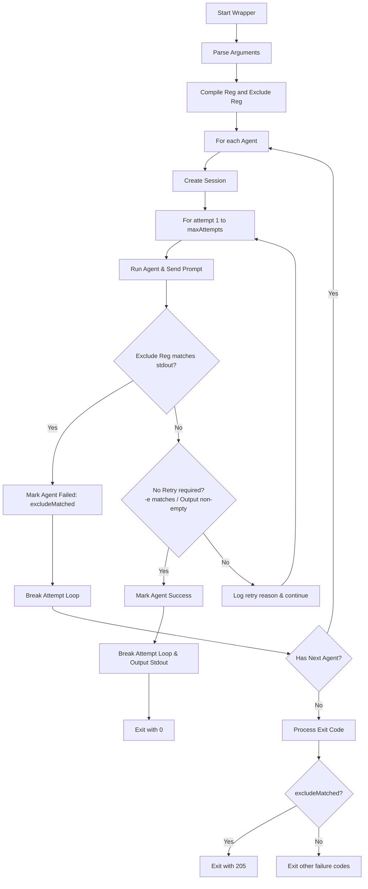

# Design Spec: Add -x, --exclude option for output matching and immediate agent failure

This design document outlines the implementation plan for adding the `-x, --exclude` option to the `wrapper` tool. This option acts as a symmetrical counterpart to `-e, --reg`. When standard output matches the exclude pattern, the agent immediately fails without further retries.

## 1. Requirements & User Intent

* **Command Option**: `-x, --exclude <模式>` (case-insensitive regex pattern).
* **Behavior**:
  * If the standard output (`stdout`, excluding standard error `stderr`) matches the exclude regex, the current agent fails immediately.
  * The wrapper stops retrying the current agent.
  * If a fallback agent exists (specified with multiple `-t`), the wrapper proceeds to the next agent.
  * If the current agent was the last one (or only one) and failed due to exclude match, the wrapper exits with a specific exit code `205` (`EXIT_EXCLUDE_MATCH`).
* **Interaction with `-e`**: The exclude pattern is checked first. If `-x` matches standard output, the agent fails immediately (no retry, no success check for `-e`).

## 2. Architecture & Control Flow



## 3. Implementation Details

### 3.1 Option Parsing

In [src/main.js](file:///Users/weizhoulan/Documents/git/wrapper/src/main.js), update argument parsing:

* Update `HELP` text:
  ```
    -e, --reg <模式>         用于匹配输出的正则表达式(大小写不敏感)，如果不匹配则会重试运行命令 
    -x, --exclude <模式>      用于匹配标准输出的正则表达式(大小写不敏感)，如果匹配成功,则直接宣告当前 agent 失败，并且不再重试该 agent
  ```

* Add `exclude` to options configurations inside `parseArgs`:
  ```javascript
  exclude:   { type: "string", short: "x" }
  ```

* Expose the field:
  ```javascript
  return {
    prompt: values.prompt,
    debug: values.debug,
    reg: values.reg || "",
    exclude: values.exclude || "",
    // ...
  }
  ```

### 3.2 Constants and Helpers

* Add new exit code constant:
  ```javascript
  const EXIT_EXCLUDE_MATCH = 205;
  ```

* Update exports list:
  ```javascript
  module.exports = {
    // ...
    EXIT_EXCLUDE_MATCH
  };
  ```

* Add error/reason helper:
  ```javascript
  function excludeReason(stdout, regex) {
    return `exclude regex /${regex.source}/ matched, stdout: ${stdout.slice(0, 80).replace(/\n/g, "\\n")}`;
  }
  ```

### 3.3 Execution Loop (`main` function)

Inside `main()`:
* Compile `excludeRegex`:
  ```javascript
  const excludeRegex = opts.exclude ? new RegExp(opts.exclude, "i") : null;
  ```

* Add the check inside the attempts loop:
  ```javascript
  if (excludeRegex && excludeRegex.test(lastResult.stdout)) {
    log.error("agent %s attempt %d: excluded pattern matched — %s", agent.commandName, attempt + 1, excludeReason(lastResult.stdout, excludeRegex));
    allResults.push({
      commandName: agent.commandName,
      stdout: lastResult.stdout || "",
      stderr: lastResult.stderr || "",
      sessionId: session.sessionId || lastResult.sessionId || "",
      excludeMatched: true,
    });
    agentDone = true;
    break; // stop attempts for the current agent
  }
  ```

* Process Exit Code at the end of `main()`:
  ```javascript
  if (lastAgentResult.excludeMatched) {
    process.exit(EXIT_EXCLUDE_MATCH);
  }
  ```

## 4. Test Strategy

1. **Unit Tests** in [test/main.test.js](file:///Users/weizhoulan/Documents/git/wrapper/test/main.test.js):
   * Validate that `-x` and `--exclude` options are correctly parsed.
   * Validate that exit code `EXIT_EXCLUDE_MATCH` is `205`.

2. **Integration / Smoke Tests** in [test/smoke.test.js](file:///Users/weizhoulan/Documents/git/wrapper/test/smoke.test.js) (or a similar test file):
   * Add a test case mimicking agent execution that produces standard output matching `--exclude`.
   * Verify it fails immediately (retry count is not consumed).
   * Verify the exit code is `205`.
   * Add a test case with multiple agents where the first agent matches `--exclude` and fails, and the second agent runs successfully.
